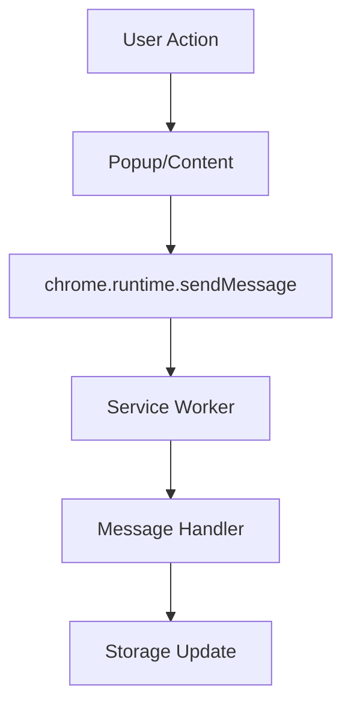

# Architecture Specification

## Directory Structure

```text
├── manifest.json       # V3 manifest (entry point)
├── src/
│   ├── background/     # Service Worker (Orchestrator)
│   │   └── lib/        # SW modules (icon, navigation, message dispatch)
│   ├── content/        # Content scripts
│   │   ├── content.js  # Main content logic
│   │   ├── email-scanner.js # Email Orchestrator
│   │   └── email/      # Email modules (UI, extraction, observer)
│   │       └── link-interceptor.js # Outbound Click Protection
│   ├── popup/          # Extension popup UI
│   │   ├── popup.js    # UI Orchestrator
│   │   └── modules/    # UI renderers and helpers
│   └── lib/            # Shared utilities
│       ├── analyzer/   # Heuristic engines (URL, Phrase, Email)
│       └── storage.js  # Atomic persistence layer
├── tests/
│   ├── unit/           # Jest + jest-chrome mocks
│   └── regression/     # Bug regression tests
└── dist/               # Build output (git-ignored)
```

## Data Flow


